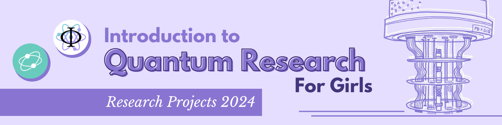

# Spotify Music Recommendation Based on Personality Traits

The main purpose of this research project was to implement a Quantum Neural Network that would return song recommendations as output when given a certain personality type as input. This was done to test whether the quantum advantage would exist in this case or not. Obtained results are in allegiance with relevant studies in the field and show no sign of quantum supremacy in Machine Learning algorithms.
